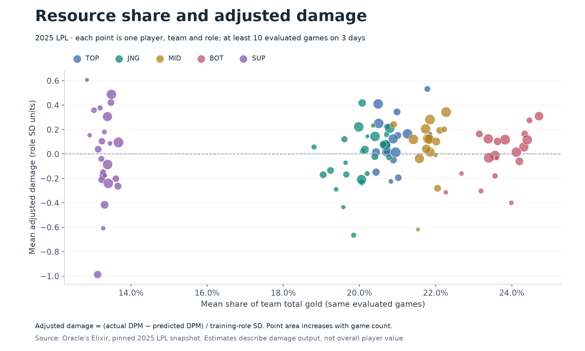
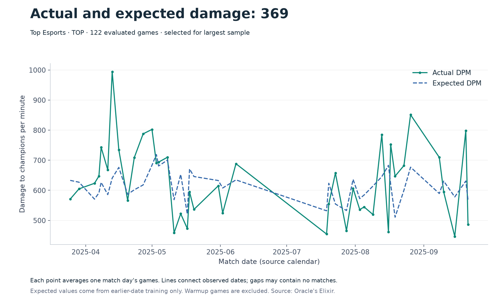
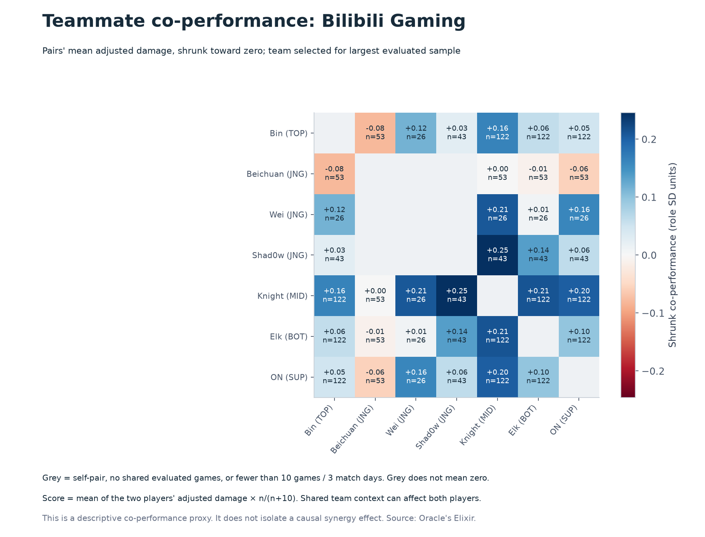

# Measuring Lineup Synergy in the LPL

**STATS 401 final project · In-class demo progress check**

**Group:** Terasa Tu and Xuye Chen

This demo follows the project from **player → pair → lineup**. The backend is implemented: real match data, a context-adjusted damage baseline, reusable analytical tables and **three working static visualizations**. Interaction designs below are planned; user evaluation has not yet been conducted.

[Original proposal](proposal.md) · [Dataset and frontend contract](data/README.md) · [Model and validation](model/README.md) · [中文后端交接说明](model/HANDOFF_ZH.md)

## Dataset

Source: [Oracle's Elixir](https://oracleselixir.com/tools/downloads), retrieved through a [pinned public mirror](https://github.com/cbplexiglass/LoL-Esports-Regional-Analyses/blob/ff34a9f935070b7a9c9610cff423eac1fd6deddc/2025_LoL_esports_match_data_from_OraclesElixir.csv).

| Stage | Contents |
|---|---|
| Raw | 9,660 LPL 2025 rows, 165 original columns: 8,050 player rows + 1,610 team rows |
| Processed | 805 games, 99 players, 16 teams, 46 five-player lineups |
| Observed date range | January 12–September 21, 2025 |
| Model evaluation | 6,570 player rows from 657 later games; 1,480 initial rows reserved for warmup |
| Frontend exports | Player-game detail; player, pair, lineup, team and daily summaries; filterable pair-game and lineup-game detail |

**Cleaning completed:** checked types and missing values; validated ten distinct players and five unique roles per side; verified opponents and a single winning side; generated stable player/pair/lineup keys; derived gold share, damage share, DPM and vision per minute. Exact duplicates and invalid games are detected by the pipeline; this snapshot contained neither. All 8,050 player rows were retained.

**Missing data:** all source rows are labeled `partial`. Minute-15 gold/XP/CS differences are absent and remain null. The demo uses available damage, gold, combat and vision fields. It does not claim complete objective-participation data. Full provenance and missingness counts are linked in the [dataset documentation](data/README.md).

## Static visualizations and interaction plan

All figures below are generated by [`model/plots.py`](model/plots.py) from the actual processed data. Run `python model/run.py` to rebuild them. They are implemented static plots, not sketches. DPM means damage to champions per minute.

### 1. Resource–impact scatterplot



Each point is one player/team/role. The horizontal axis shows the player's mean share of team total gold; the vertical axis shows mean adjusted damage. Color indicates role and point area increases with evaluated game count. Players need at least 10 evaluated games on 3 match days to appear. Gold and damage summaries use the same games.

**Planned interaction:** filter by team and role; hover for names, game count and metric definitions; click a player to update the timeline and highlight their heatmap row. Purpose: compare players in relevant roles and inspect the observations behind an apparent outlier. Short position transitions will preserve object identity when filters change.

### 2. Actual versus expected performance timeline



This example shows **369 on Top Esports**, selected by evaluated sample size rather than score. Each point averages that day's games. Expected values come from models trained on strictly earlier days. Connecting lines span observed match dates; they do not imply daily observations.

**Planned interaction:** choose a player; brush a date interval; hover for actual/expected DPM, patch and game count; optionally reveal the series in date order. Purpose: locate periods above/below the context baseline and inspect whether a trend is sustained. Animation will be optional and pausable, with reduced-motion support.

### 3. Teammate co-performance heatmap



The example uses **Bilibili Gaming**, selected by evaluated sample size. A cell averages the two teammates' adjusted damage in games together, then multiplies by `n/(n+10)` to stabilize small samples. Values use a diverging scale centered on zero; each cell reports its game count. Grey indicates self-pairs, unavailable pairs or insufficient samples.

**Planned interaction:** select a team; adjust minimum games; hover for raw/shrunk score, sample size and interval; click a pair to highlight its two players and shared dates. Purpose: compare relationships while keeping sparse data visible as a limitation. Color updates will use a fixed scale for comparisons.

**Interpretation:** these are descriptive **co-performance** scores. The demo has not isolated causal synergy. Players share match conditions, and DPM captures only one aspect of play. Roster-swap predictions remain future work.

## Model progress

A one-hot Ridge baseline predicts DPM from role, role/champion, opposing champion, patch, side, team and opponent team. It excludes current-game outcomes and post-game statistics from predictors. Five chronological date blocks supply one warmup block and four expanding-training evaluation blocks.

| Model | Mean absolute error (DPM) | RMSE (DPM) | R² |
|---|---:|---:|---:|
| Historical role mean | 142.205 | 189.143 | 0.502 |
| Context Ridge | 129.868 | 174.214 | 0.578 |

Adjusted damage is `(actual DPM − expected DPM) / training-role SD`. Sample counts and 95% match-day bootstrap intervals are exported for summaries. Intervals omit model uncertainty. See [full definitions and per-role evaluation](model/README.md).

## Evaluation plan

**Status: planned. No user-study responses or usability results are claimed.**

Recruit **5–8 classmates**, including viewers with different levels of League of Legends familiarity. Give each participant a short definition of DPM and adjusted damage, then ask them to complete three tasks while thinking aloud. Counterbalance task order when feasible.

| What we will evaluate | How we will evaluate it | Data / feedback we will collect |
|---|---|---|
| Scatterplot comprehension and comparison | Ask participants to select two players in the same role and identify who has higher adjusted damage at similar gold share; confirm with the exported table | Correct/incorrect answer, time to answer, selected players, confidence (1–5), misunderstood labels |
| Timeline trend interpretation | Ask participants to locate an observed period when actual DPM exceeds expected DPM and explain a gap between dates | Answer accuracy, task time, chosen interval, whether gaps were mistaken for observed daily data |
| Heatmap meaning and sample-size awareness | Ask participants to find a well-supported positive pair, explain a grey cell, and interpret a small-sample score | Chosen pair and sample count, accuracy, confidence, whether the score is incorrectly interpreted as a causal effect |
| Linked-view usability once interactions exist | Observe player selection, filter changes and cross-view highlighting; ask users to recover the initial view | Completion rate, misclicks, dead ends, comments on filter state and link consistency |
| Accessibility and visual clarity | Check color distinctions, labels, keyboard access, reduced motion and readable layout; ask participants which encodings are unclear | Navigation failures, readability ratings (1–5), color/label issues and suggested changes |
| Analytical reliability | Continue chronological evaluation against the role-mean baseline; inspect errors by role/patch, rare pairs and sensitivity to minimum games/shrinkage | MAE/RMSE, per-role residuals, interval widths, counts and changes in pair ordering |

Record anonymous participant codes, self-reported LoL familiarity, task answers, completion times, confidence/clarity ratings and short comments. Summarize completion rates, median task times and recurring misunderstandings. Revise labels, missing-data encoding and filtering behavior, then repeat the affected tasks. Small convenience-sample feedback will guide design; it will not be presented as a population-level usability estimate.

## Run and integrate

```bash
python -m venv .venv
source .venv/bin/activate
pip install -r model/requirements.txt
python model/run.py
python -m unittest discover -s model/tests -v
```

Frontend integration starts with [`data/processed/dashboard.json`](data/processed/dashboard.json). From `view/index.html`, use `../data/processed/dashboard.json`. The existing `view/` remains the location for the group's D3 interface. Network and parallel-coordinates views are planned; their pair and lineup data are already exported.

The repository README contains the demo progress material. A deployed **GitHub Pages website** is a separate deliverable: the frontend must embed the figures/data and publish a working page before that website URL is submitted if the course requires a `github.io` page.
